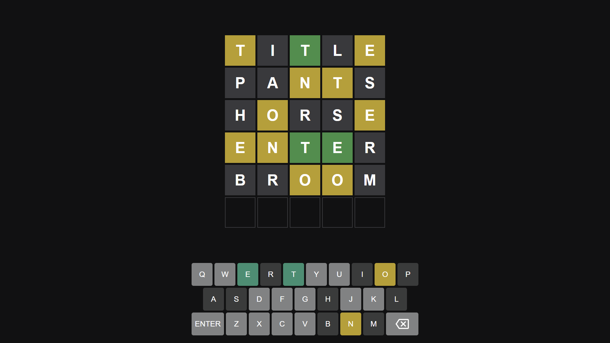

# Wordle-Clone
A game in which you have six attempts to guess a word.

<h2>Rules of the game</h2>
<ul>
  <li>Six attempts to guess a word</li>
  <li>If you guess the word correct YOU WIN!</li>
  <li>If you run out of attempts then the correct word is displayed</li>
  <li>If you guess an incorrect word but some of those characters are present in the original word then that particular character changes to YELLOW</li>
  <li>Character not present in the original word are displayed BLACK</li>
</ul>

<h2>Running it locally on your machine</h2>
Just simply clone the repo

<h2>Built With</h2>
<ul>
  <li>HTML</li>
  <li>CSS</li>
  <li>Javascript</li>
</ul>

<pre>
<h1>Snapshot</h1>

Here is the snapshot :-

</pre>

